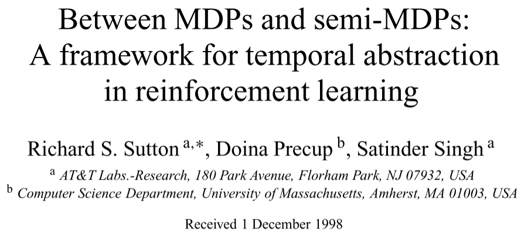
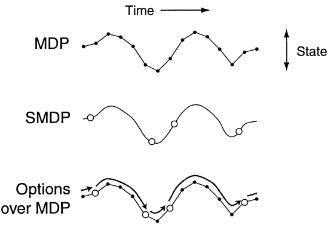

# [Options] Between MDPs and Semi-MDPs: A Framework for Temporal Abstraction in Reinforcement Learning

> Richard S. Sutton, Doina Precup, and Satinder Singh. 1999. Between MDPs and semi-MDPs: A framework for temporal abstraction in reinforcement learning. Artificial Intelligence 112, 1 (August 1999), 181–211. DOI: https://doi.org/10.1016/S0004-3702(99)00052-1

## Introducing Options to MDP

***Options***: the generalization of primitive actions to include **temporally extended** courses of action.

A ***Markov option***, which can be represented as $\langle I,\pi,\beta \rangle$, consists of three components:

* A **policy** $\pi : S \times A \rightarrow [0,1]$: the policy only taken in this option, to map the current state to a probability of taking an action.
* A **termination condition** $\beta: S^+ \rightarrow [0,1]$: the mapping function for each state in the option to a probability to terminate the option.
* An **initiation set** $I \subseteq S$: a set of states that indicates the option can start from.

An option $\langle I,\pi,\beta \rangle$ is available in state $s_t$ if and only if $s_t \in I$. If the option is taken, then actions are selected according to π until the option terminates stochastically according to $\beta$.

A ***semi-Markov option***, which can also be represented as $\langle I,\pi,\beta \rangle$, has some different definitions:

* A **policy** $\pi : \Omega \times A \rightarrow [0,1]$: the policy to map a **history** to an action with some probability.
* A **termination condition** $\beta : \Omega \rightarrow [0,1]$: the mapping function from a **history** to a probability to terminate the option.
* An **initiation set** $I \subseteq S$: a set of states that indicates the option can start from.

The concept ***history*** is introduced in semi-Markov options, as sometimes, we expect an option to terminate after some period of time has elapsed even if it has failed to reach any particular state, which is not possible with Markov options, where the termination decisions are only made on the basis of the current state. Suppose for a semi-Markov option, which initiate at $s_t$, we have defined a time limit, say $k$, to terminate the option, the history at time $\tau$ ($t \leq \tau < t+k$)can be defined as the entire preceding sequence $(s_t,a_t,r_{t+1},s_{t+1},a_{t+1},r_{t+2},…,r_{\tau},s_{\tau})$ and can be denoted as $h_{t\tau}$. We define the set of all possible histories as $\Omega$. Semi-Markov options include a very general range of possibilities.

We can unify any primitive action a into options by defining:
* $I=\{s:a \in A_s\}$
* $\beta(s)=1, \forall s \in S$
* $\pi(s,a)=1, \forall s \in I$

By generalizing the primitive actions to options, the paper proposed some attributes:
* We can consider sequences of actions/options as new options.
* Two options can be composed to a new option.
* ***Policies over options***: We can consider policies that select options instead of actions. The original policies over actions can be called *flat policies*.
* Both the value functions and the Q-functions can be generalized from the policies over options.

## Learning with Semi-Markov Decision Process (SMDP)

First of all, we can generalize the MDP by introducing options to ***Semi-Markov Decision Process*** (***SMDP***), which provides a basis for the theory of planning and learning methods with options.

In the SMDP model, the state space and option space have been defined. In addition, we have to define the reward functions and the transition functions:

* For reward function/model, the reward of taking an option equals to **the rewards received along the way** (**discounted by** $\gamma$):
    $r_s^o=\mathbb{E} [r_{t+1} + \gamma r_{t+2}+ ... + \gamma^{k−1} r_{t+k} | \mathcal{E}(o,s,t)]$
* The transition probability is the likelihood that starts from state $s$ and $s'$ is the state to terminate the option with discounted $\gamma$:
	$p_{ss'}^o=\sum_{k=1}^{\infty}{p(s',k)\gamma^k}$

After defining the SMDP $\langle S,O,R,T,\gamma\rangle$, we can futher genelize the Bellman equations for value function and Q-function as well as the **optimal** policy defined by them. This is the basis of planning and learning from SMDP.

The paper demonstrates two approaches, the value iteration based and the Q-function based to learn the option-policies in a four-room environment, with deterministic options (move to the hallways). The experiments show promising results compared with primitive actions based RL algorithm.

## Interrupting Options

The above option based learning/planning are conducted on **deterministic options**. In this section, the paper further proposed the ***options interruption***, in which we interrupt the option once there is a better option to complete the task before the original option terminates.

The process can be understood briefly like this: in an option $o$ with policy $\mu$ which is running currently, at a state $s_t$, once there is another option $o'$ whose $I'$ contsists of the state $s_t$ and we can compare the $Q^{\mu}(s_t,o) < V(s_t)$, then we can interrupt the original option o and start the new option $o'$.

One greedy situation is to check the value function each primitive step, which may increase the computational cost but may also derive optimal overall policy.

The paper demonstrated the option interruption by conducting experiments on two environments, one navigation task with landmark-directed controllers and one mass moving environment. The experimental results show interrupting options can give more optimal policies.

## Sub-Goals for Learning Options

This section introduces the idea to learn the policy in an option by defining a ***sub-goal*** for the option to complete. By defining a **sub-goal space** $G$, company with the ***terminal sub-goal value*** $g(s), s \in G$, which indicate how desirable it is for the option to terminate in each state in the sub-goal space. The paper proposed that in one option, the policy for the option can be learned by the optimal value/Q-value theory and the Bellman equations are also available.
