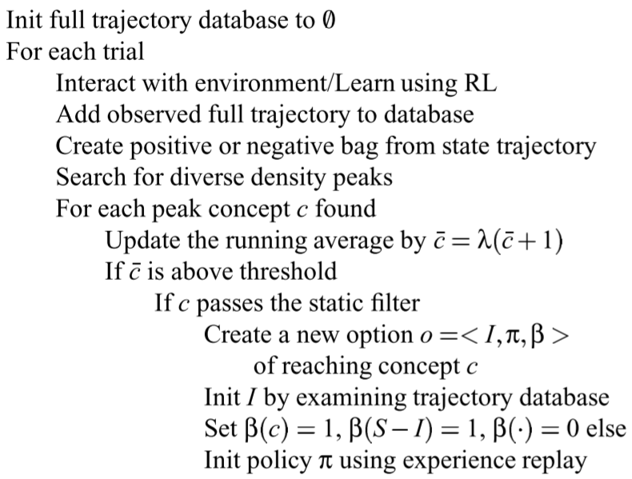

# Automatic Discovery of Subgoals in Reinforcement Learning using Diverse Density

> Amy McGovern and Andrew Barto. 2001. Automatic Discovery of Subgoals in Reinforcement Learning using Diverse Density. Computer Science Department Faculty Publication Series (January 2001). Retrieved from <https://scholarworks.umass.edu/cs_faculty_pubs/8>

## Overview

The paper proposed a automatic sub-goal discovery algorithm independently from the agent training, so that the sub-goals are learnt in a **pre-training** procedure and can be transferred to other tasks. The algorithm is an **online** method, which is based on commonalities across multiple paths to the solution. The core idea is to cast the sub-goals finding as a **multiple-instance learning** problem and use the concept of **diverse density** (DD) to find the solutions. The paper evaluated their algorithm on some k-room gridworld navigation tasks and compare with some standard reinforcement learning (RL) algorithms without sub-goals discovery.

## Main Problems to Solve

1. To learn sub-goals (a kind of state representation/description) **automatically**.
2. To **accelerate** the RL learning on the current task.
3. To facilitate the skill to **transfer** to other tasks in which the same sub-goals are useful.
4. Compared with offline methods, online algorithms need to inspect the trajectories that are gathered while learning.
5. Popular (at that time) frequency-based methods have some disadvantages:
    a. Frequency is **not** importance, e.g., the states in the first stage are mostly frequently visited, but they are not important.
    b. They are usually noisy process.
    c. Not work well in environments with continuous or very large state spaces.
    d. Visitation frequencies do not incorporate **negative** evidence.

## Main Innovations

The paper formalize the bottleneck regions finding problem as a **multiple-instance learning problem** [1], then using the concept **diverse density** (DD) [2] to solve the problem. All in all, the region with maximum DD will be a bottleneck. The bottleneck region should be a set of states (or a kind of representation/description of some states which share some common attributes), while in this paper, as the state spaces of the gridworld environments are very small, so they treated each state as a region. After generating the sub-goals, use a standard hierarchical reinforcement learning (HRL) algorithm to learn the options based on these sub-goals.

The paper defines the bottlenecks as the states (regions) in the agent's observation space that the agent tends to visit frequently on successful paths to the goals but not on unsuccessful paths. To avoid the disadvantages of frequency-based methods, the paper use the DD to evaluate the regions.

The algorithm:

## Main Drawbacks

* All negative bags cannot contain any positive instances.
* The agent must be able to reach all goals with all primitive actions, which means that, before learning the sub-goals or options, the agent must excessively explore the environment.

## Reference

[1] Thomas G. Dietterich, Richard H. Lathrop, and Tomás Lozano-Pérez. 1997. Solving the multiple instance problem with axis-parallel rectangles. Artificial Intelligence 89, 1–2 (January 1997), 31–71. DOI:<https://doi.org/10.1016/S0004-3702(96)00034-3>

[2] Oded Maron and Tomás Lozano-Pérez. 1997. A Framework for Multiple-Instance Learning. In Advances in Neural Information Processing Systems, MIT Press. Retrieved July 13, 2022 from <https://proceedings.neurips.cc/paper/1997/hash/82965d4ed8150294d4330ace00821d77-Abstract.html>

