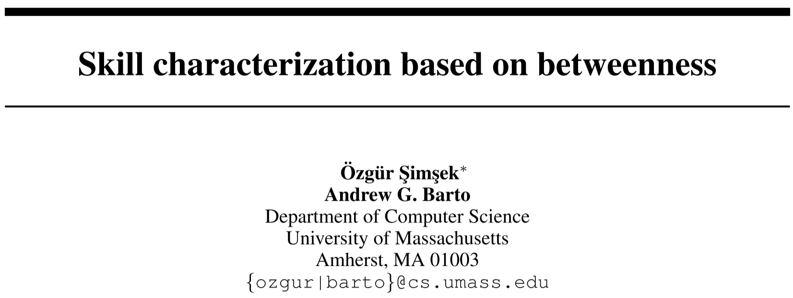

# Skill Characterization Based on Betweenness

> Özgür Şimşek and Andrew Barto. 2008. Skill Characterization Based on Betweenness. In Advances in Neural Information Processing Systems, Curran Associates, Inc. Retrieved July 6, 2022 from <https://proceedings.neurips.cc/paper/2008/hash/934815ad542a4a7c5e8a2dfa04fea9f5-Abstract.html>

## Overview

The paper proposed an algorithm to select sub-goals (a set of important states) based on the **interaction graph** and calculating the ***betweenness***, based on which, RL agents can learn skills from the selected sub-goals to accelerate its learning. In the first part, the paper supposed we have full knowledge about the interaction graph, in this case, based on an enhanced version of betweenness, the algorithm can select sub-goals with maximum calculated betweenness. In the second part, the paper further thought about problems with limited knowledge and proposed an incremental discovery algorithm. The algorithm is evaluated the basic algorithm on three environments: *Taxi*, *Playroom* and *Tic-Tac-Toe* and the incremental algorithm on two grid-worlds.

## Main Innovations

The paper captures and generalizes (at least intuitively) the bottleneck concept and enhanced the definition of **skill** by defining the **betweenness** to introduce the expected negative reward function as the weights of the edges in the **interaction graph**. The new measure for evaluating how pivotal a vertex (in the interaction graph) $v$ is:

$$
\sum_{s \neq t \neq v}{\frac{\sigma_{st}(v)}{\sigma_{st}}w_{st}}
$$

Where $σ_{st}$ is the number of the shortest paths from vertex $s$ to $t$, $σ_{st}(v)$ is the number of such paths that pass through vertex $v$, and $w_{st}$  is the weight assigned to the paths. The betweenness without the $w_{st}$  is the old version, where all weights are 1. The paper defines the weights on the edges as the expected cost of the transition, or expected negative rewards, which introduces the RL reward signals.

Based on the newly defined betweenness, suppose we have the full knowledge of the environment (like the transition functions and reward functions), we can get the interaction graph and calculate the betweenness for each vertex (state), the states with highest values (in a region, which is defined as ***neighboorhood***) are selected as the sub-goals. Based on these sub-goals, the agent can learn high-level skills from some HRL algorithms. 

The incremental discovery algorithm released the strict limitation that we need the full knowledge or the full interaction graph, but turned to sub-graphs. The algorithm is founded on the premise that local maxima of betweenness of the interaction graph are likely to be local maxima on its subgraphs. So only based on some shorter trajectories collected in the training, the agent can build some sub-graphs and learn the local maximum betweenness on these sub-graphs.

## Main Drawbacks

* The algorithm requires full knowledge of the environment to build the full interaction graph, i.e., it needs to know the transition functions and reward functions, which is usually very difficult.
