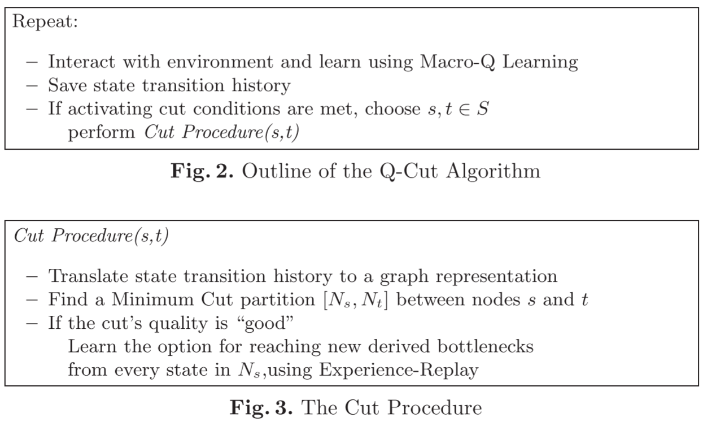

# [Q-Cut] Q-Cut - Dynamic Discovery of Sub-goals in Reinforcement Learning

> Ishai Menache, Shie Mannor, and Nahum Shimkin. 2002. Q-Cut—Dynamic Discovery of Sub-goals in Reinforcement Learning. In Machine Learning: ECML 2002 (Lecture Notes in Computer Science), Springer, Berlin, Heidelberg, 295–306. DOI: https://doi.org/10.1007/3-540-36755-1_25

## Overview

The paper proposed ***Q-Cut algorithm*** and the advanced ***Segmented Q-Cut algorithm***. Q-Cut algorithm is based on the **graph** which is build from the transition histories collected by the agent in the training. The algorithm adopts *Max-Flow* or *Min-Cut* graph theoretic methods [1] to find the bottlenecks, based on which, the agent can learn options from the sub-goals to accelerate the learning. The algorithm is an **on-line** method and can be deployed in **dynamic environment**. The paper extended the Q-Cut algorithm to the Segmented Q-Cut algorithm, which is a recursive version to divide the graph into many segments and adopt the Q-Cut in each segments. The Segmented Q-Cut algorithm can be used in complex environments to find additional bottlenecks.

## Main Innovations

The Q-Cut algorithm is based on the transition graph which is built from the transition histories collected from the learning procedure. 

1. It uses the *Max-Flow* or *Min-Cut* graphical algorithm to find the states on the path with minimum cut. The paper implements the *Preflow-Push* algorithm [2] which has a time complexity of $O(n^3)$, where $n$ is the number of nodes.
2. To address the frequency-based problem, the algorithm gives the capacity of the edge $i \rightarrow j$ as the *relative frequency* $\frac{n(i,j)}{n(i)}$ , where $n(i,j)$ is the number of the transitions including path from $i$ to $j$, $n(i)$ is the number of the transitions including state $i$. In this case, Q-Cut algorithm can find "better" cuts not only based only on the frequency. For example, the algorithm can indetify both two paths as bottlenecks, although the frequency of passing them are not exactly same in the following figure.

    

3. The extended Segmented Q-Cut algorithm is a recursive version of Q-Cut. The algorithm firstly find the first bottleneck which can divide the graph to two segments, and adopts the Q-Cut algorithm in all segments until getting all bottlenecks.

The Q-Cut algorithm:

The Segmented Q-Cut algorithm:

## Main Drawbacks

* As a frequency-based algorithm, the Q-Cut needs the agent to excessively explore the environment to derive "correct" bottlenecks accordingly.

## Reference

[1] Ravindra K. Ahuja, Thomas L. Magnanti, and James B. Orlin. 1993. Network flows: theory, algorithms, and applications. Prentice Hall, Englewood Cliffs, N.J.

[2] Andrew V. Goldberg and Robert E. Tarjan. 1988. A new approach to the maximum-flow problem. J. ACM 35, 4 (October 1988), 921–940. DOI:https://doi.org/10.1145/48014.61051
