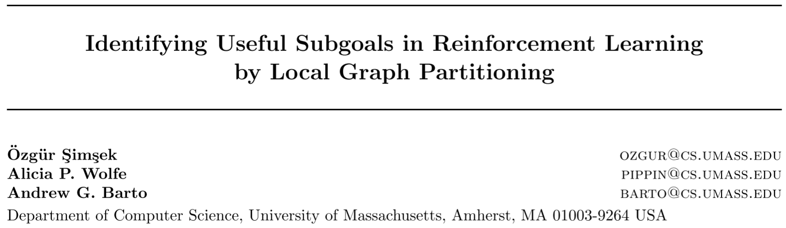

# [L-Cut] Identifying Useful Subgoals in Reinforcement Learning by Local Graph Partitioning

> Özgür Şimşek, Alicia P. Wolfe, and Andrew G. Barto. 2005. Identifying useful subgoals in reinforcement learning by local graph partitioning. In Proceedings of the 22nd international conference on Machine learning (ICML ’05), Association for Computing Machinery, New York, NY, USA, 816–823. DOI: https://doi.org/10.1145/1102351.1102454

## Overview

The paper proposed an algorithm called ***L-Cut***, which originated from the main idea to partition ***local*** state transition graphs. The L-Cut algorithm builds a sub-graph using only **the most recent experiences** of the agent. The algorithm is **on-line**, which aims to find the bottlenecks in advance and adopts standard RL algorithm to learn the skills or options. The algorithm can be seen as an updated version of Q-Cut algorithm [1], where the Q-Cut builds the transition graph globally while the L-Cut builds the transition graph locally. In this case, the L-Cut algorithm can compute with very low computational cost and the time complexity doesn’t grow along the state space. The paper evaluates L-Cut algorithm in grid-room and *Taxi* environments.

## Main Innovations

1. The main improvement of L-Cut algorithm based on the Q-Cut algorithm is to **build the local transition graph only based on the most recent** $h$ **experiences** of the agent, where $h$ is one hyper-parameter, which defines the scope of the local region.
2. The algorithm builds the local transition graph and find one best cut from the corresponding graph periodically, which means after $N$ epochs of the agent training, the algorithm generate one graph based one experience, where $N$ is one hyper-parameter. In this case, the algorithm will get many cuts (one cut for one round of building graph), so it selects ***hits*** from the cuts based on one criterion and finally select the sub-goals from the hits also based on some evaluation criteria.
3. The time complexity of L-Cut is $O(h^3)$ where h is the **length of the state trajectory used to contrust the sample transition graphs**, regardless of the size of the actual state space. This is also one of the main advantages compared with Q-Cut.
4. The paper also proposed another approach, which builds and maintains the entire global transition graph but compute the cuts only based on part of it. This approach would be effective in identifying the cuts but is not suitable for complex environments.

## Main Drawbacks

* The algorithm is very sensitive of the local scope to build the graph, so the hyper-parameter to sample experiences is very important.

## Reference

[1] Ishai Menache, Shie Mannor, and Nahum Shimkin. 2002. Q-Cut—Dynamic Discovery of Sub-goals in Reinforcement Learning. In Machine Learning: ECML 2002 (Lecture Notes in Computer Science), Springer, Berlin, Heidelberg, 295–306. DOI:https://doi.org/10.1007/3-540-36755-1_25
