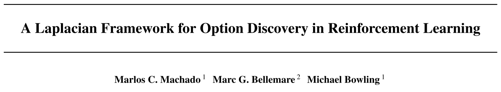

# A Laplacian Framework for Option Discovery in Reinforcement Learning

> Marlos C. Machado, Marc G. Bellemare, and Michael Bowling. 2017. A Laplacian Framework for Option Discovery in Reinforcement Learning. In Proceedings of the 34th International Conference on Machine Learning, PMLR, 2295–2304. Retrieved July 6, 2022 from https://proceedings.mlr.press/v70/machado17a.html

## Overview

The paper proposed an option discovery algorithm based on **representation learning**. ***Proto-value functions (PVFs)*** [1][2] are a well-known approach for representation learning, the paper uses PVFs to introduce ***eigen-purposes***, which works as a kind of intrinsic reward functions implicitly derived from the learned representations. Then given the eigen-purposes, the problems turn to a standard RL problem and the agent can learn the ***eigen-behavior***, which can be seen as the policy to solve the problem. Finally, the algorithm formalize the *eigen-behavior* to get the ***eigen-options***. The main part of the algorithm is to compute the PVFs from representation learning without taking the environment's rewards into consideration, so the learned options/skills can be easily implemented into other tasks. The paper also demonstrates that the algorithm can **help with the exploration**. They extended the basic version of the algorithm to deploy it into function approximation situations. Finally, the paper evaluated the proposed method in both grid-maze environments as well as Atari games.

## Main Problems to Solve

The paper introduced representation learning into option discovery, mainly solve three problems:

1. Bad/wrong options may hinder the performance of the agent to explore the environment, the proposed method has been proved to be able to help with the exploration.
2. Previous option discovery algorithm only conducts experiments in traditional tabular domains (grid environments), the paper proposed the extended version for function approximation, which can be used in deep RL.
3. For frequency-based methods, in very complex environments, as the state space is very large, so each state is very hard to be visited for many times, in this case, the frequency is hard to be found.

## Main Innovations

The main innovation for the proposed algorithm is the introducing of representation learning. The algorithm use the PVFs, one important approach in representation learning to do options discovery. The main procedure of the algorithm is as follows:

1. The algorithm defines the **purpose** of the agent based on the PVFs as a kind of rewards for it to maximize. The *eigen-purposes* derived from PVFs are transition graph based, independently from the environment's rewards.
2. After deriving the *eigen-purposes*, the problem turns to be a standard RL problem and the agent can learn the *eigen-behaviors* from *eigen-purposes*, which can be seen as the policies to achieve the purposes.
3. Finally, given the *eigen-behaviors*, we can formalize the *eigen-options*.

The paper proposed and evaluated some features of the algorithm:
* The algorithm can help with the exploration.
* The algorithm can be extended to linear function approximation approaches.

Reference

[1] Sridhar Mahadevan. 2005. Proto-value functions: developmental reinforcement learning. In Proceedings of the 22nd international conference on Machine learning  - ICML ’05, ACM Press, Bonn, Germany, 553–560. DOI:https://doi.org/10.1145/1102351.1102421

[2] Sridhar Mahadevan and Mauro Maggioni. 2007. Proto-value Functions: A Laplacian Framework for Learning Representation and Control in Markov Decision Processes. J. Mach. Learn. Res. 8, (December 2007), 2169–2231.

