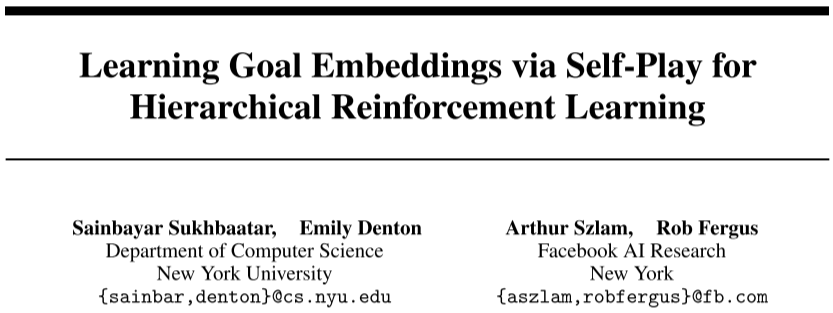
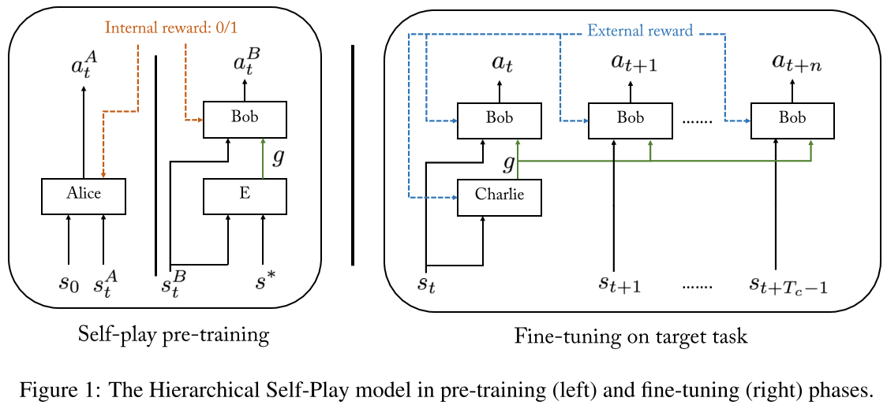

# [HSP] Learning Goal Embeddings via Self-Play for Hierarchical Reinforcement Learning

> Sainbayar Sukhbaatar, Emily Denton, Arthur Szlam, and Rob Fergus. 2018. Learning Goal Embeddings via Self-Play for Hierarchical Reinforcement Learning. (November 2018). DOI: https://doi.org/10.48550/arXiv.1811.09083

## Overview

The paper prosed ***Hierarchical Self-Play (HSP)*** algorithm, which trains a hierarchical reinforcement learning model to automatically learn sub-goals in an unsupervised way based on the ***asymmetric self-play*** [1]. The HSP algorithm consists of two main phases: a) in the first phase, it trains the low-level module by the self-play method to learn to accomplish target-identified sub-tasks (or to reach sub-goals); b) in the second phase, it trains the high-level module to generate sub-goal sequences to feed to low-level module. The sub-goals are discovered in a **pre-training phase**. The paper evaluates the algorithm on *Mazebase* and *Mujoco* environment, including the *AntGather* task.

## Main Problems to Solve

The algorithm is proposed mainly to solve the sub-goal spaces representation problems in HRL domains:

1. The sub-goal space should be general enough to **cover the full range** of sub-tasks in the environment.
2. The information which is task-irrelevant should be abstracted away.
3. The representation should be easy for both high level and low level modules to use.

## Main Innovations

The algorithm introduces **asymmetric self-play** algorithm to pre-train the **low-level model** to a) excessively explore the environment and b) learn to complete sub-tasks and c) generate sub-goals for the high-level. One of the most interesting aspects is it trains the low-level module before the entire hierarchical model. The high-level module is designed not to generate next-stage sub-goals for each period of time, instead, to generate a sequence of sub-goals (or **a continuous sub-goal vector**) directly. The algorithm works as follows:

1. In the **pre-training phase**, it trains the low-level model $\pi_B$  accompanied by another agent $\pi_A$. The $\pi_A$  aims to explore the environment and reach a goal state $s^∗$, which will be used as the goal for $\pi_B$. After $\pi_A$  executes, the environment is reset to the beginning when $\pi_A$  starts, then it turns to $\pi_B$. After taking some steps, an evaluation function, which is called **distance funcction** $D$ to measure whether the $\pi_B$  has been reached the target state $s^∗$, and return to it a reward, where 1 for success, 0 for failure. The reward for $\pi_A$  is set to $1−r_B$. In this case, the two agents are running a competition against each other, in which the $\pi_A$  aims to search for new target states that $\pi_B$  cannot reach easily, while $\pi_B$  aims to optimize the policy to reach the target. **This can encourage the low-level agent to thoroughly explore the environment as well as optimize the policy unsupervisedly**. 
2. In the second phase, the model trains the high-level module and fine-tunes the low-level module. The high-level module learns to generate a sequence of sub-goals (sub-goal vector) at the current state and feeds the vector to the low-level policy to accomplish.

The algorithm can be illustrated as follows:

## Main Drawbacks

The main drawbacks or the points that can be improved are:

* The choice of distance function D (the distance function used to decide if the self-play task has been completed successfully or not) requires some domain knowledge.
* The low-level model only consists of one policy, which is expected to complete several different tasks.

## Reference

[1] Sainbayar Sukhbaatar, Zeming Lin, Ilya Kostrikov, Gabriel Synnaeve, Arthur Szlam, and Rob Fergus. 2018. Intrinsic Motivation and Automatic Curricula via Asymmetric Self-Play. DOI:https://doi.org/10.48550/arXiv.1703.05407
