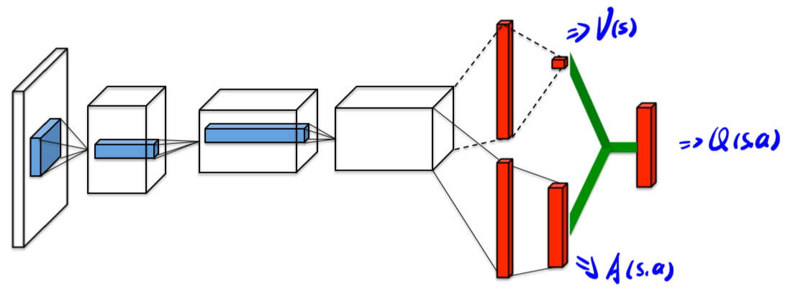

# [Dueling DQN] Dueling Network Architectures for Deep Reinforcement Learning

> Ziyu Wang, Tom Schaul, Matteo Hessel, Hado Hasselt, Marc Lanctot, and Nando Freitas. 2016. Dueling Network Architectures for Deep Reinforcement Learning. In Proceedings of The 33rd International Conference on Machine Learning, PMLR, 1995–2003. Retrieved August 8, 2022 from https://proceedings.mlr.press/v48/wangf16.html

## Overview

The paper proposed a creative network **architecture** called ***dueling network*** to **decouple the value and advantage** in deep Q-networks algorithm. The architecture can be used to replace the original network in any applicable deep RL algorithm without imposing any change to the underlying algorithm. The authors conducted experiments to show better performances that outperform the state-of-the-art algorithms (2016-6) on Atari games domain.

## Main Problems to Solve

The new architecture main solves the following problems:
* In most environments, for many states, the selection of actions is almost irrelevant, which means, for these states, selecting any action by the agent does not affect the environment any more.
* In most popular deep RL algorithms, like DQN, DDQN, the difference of the Q-values among different actions are usually very small, which is easy to be influenced by any noise or oscillation.

## Main Innovations

The proposed architecture is shown in the following figure:

At the end of the convolutional layers, the dueling network separate the output to two streams, one to estimate the state value $V(s)$ (a scaler) and one to estimate the ***advantage function*** of each action for the current state $A(s,a)$ (a vector with length of $|A|$). Then the network use a sepcial **aggregating layer** to combine the value and the advantage together to output the Q-value $Q(s,a)$.

The relationship among these qualities under a specific policy $\pi$ is:

$A^{\pi}(s,a)=Q^{\pi}(s,a)−V^{\pi}(s)$

which indicates that the advantage is the Q-value but measured by the value of that state, in this case, we actually have: $\mathbb{E}_{a \backsim \pi(s)}[A^{\pi}(s,a)]=0$. The advantage is a **relative measure** of the importance of each action.

One important problem is that: actually, in deep Q-networks based algorithms, we only estimate the final output Q-values in the algorithm, but not explicitly estimate or give out the state values and action advantages, and we cannot **recover** these two values only based on the given Q-value. So, to address this issue of identifiability problem, the paper **forced the advantage function estimator to offset by the maximal of all advantages or the average of all advantages**:

* $Q(s,a)=V(s)+(A(s,a)−\max_{a'}⁡{A(s,a')})$
* $Q(s,a)=V(s)+(A(s,a)−\frac{1}{|A|}\sum_{a'}{A(s,a')})$

This trick, on the one hand, loses the original semantics of V and A because they are now off-target by a constant, but on the other hand, it increases the stability of the optimization. What's more, this doesn't change the relative rank of the A (and hence Q) values and the values can be computed **automatically**.

The paper evaluated the performance of the above two methods, and show the results based on the second equation.
