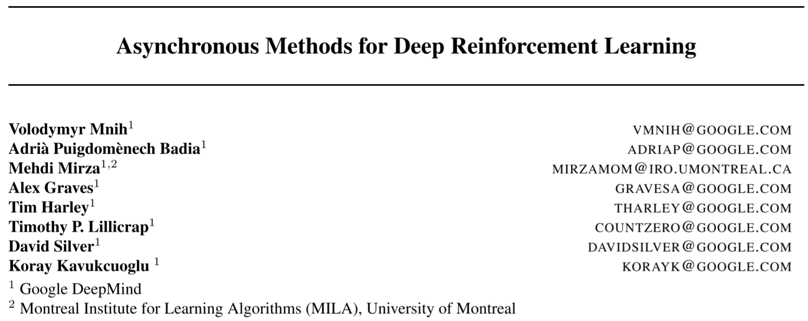

# [A3C] Asynchronous Methods for Deep Reinforcement Learning

> Volodymyr Mnih, Adria Puigdomenech Badia, Mehdi Mirza, Alex Graves, Timothy Lillicrap, Tim Harley, David Silver, and Koray Kavukcuoglu. 2016. Asynchronous Methods for Deep Reinforcement Learning. In Proceedings of The 33rd International Conference on Machine Learning, PMLR, 1928–1937. Retrieved October 4, 2022 from https://proceedings.mlr.press/v48/mniha16.html

## Overview

The paper proposed a general framework to train RL agents asynchronously. The main idea is to initialize multiple learners on multiple threads of the multiple-core CPUs. There is a **global** learner and multiple **actor** learners. The actor learners push their parameters to the global learner and pull parameters from it. In this case, the samples from multiple learners can **de-correlate** the relations from the sequential trajectories, so that on-line learning can be conducted in deep RL domain, and save time and computing resources effectively. The paper implemented the asynchronous approach into four existing RL algorithms:

- Asynchronous one-step Q-learning
- Asynchronous one-step SARSA
- Asynchronous n-step Q-learning
- ***Asynchronous Advantage Actor-Critic (A3C)***

where the last one achieves best performance. The paper conducted some experiments on Atari games and show the A3C algorithm outperforms the best current baselines.

## Main Problems to Solve

1. Many deep reinforcement learning algorithms turns to off-policy approaches, as online learning cannot decorrelate the relations among the sequential transitions. So many techniques are proposed, e.g., experience replay to **aggregate over memory**. In this case, they usually requires off-policy learning.
2. The experience replay based algorithms or massively distributed architectures use more memory and computation per real interaction.

## Main Innovations

The paper proposed a conceptually simple and lightweight framework for deep reinforcement learning that uses asynchronous gradient descent for optimization of deep neural network controllers. The algorithm instantiates multiple learners on multiple threads on multiple-core CPUs and one global learner. The workers parallelly learn in their own environment instances and share gradients or parameters with the global learner. In this case, there are several advantages:

1. The workers sample and learn by interacting with their own environments, so the samples are not correlated with each other, which solves the main problem of on-line RL approaches.
2. Since the parallelism can decorrelates the data, then no experience replay is needed, which saves much time and computing resources, makes it possible to train agents on multiple-core CPUs but not GPUs, and even use much shorter time than training on GPUs.
3. The main idea can make on-line algorithms to be implemented into deep RL domains, like actor-critic.
4. Compared with the massively distributed approaches, the workers and the global learner are set on one single machine but multiple cores of CPU, so there is no need to cost time and resources on the communication between the machines.
5. Different learners can have different exploration policies, so that better de-correlate the samples.