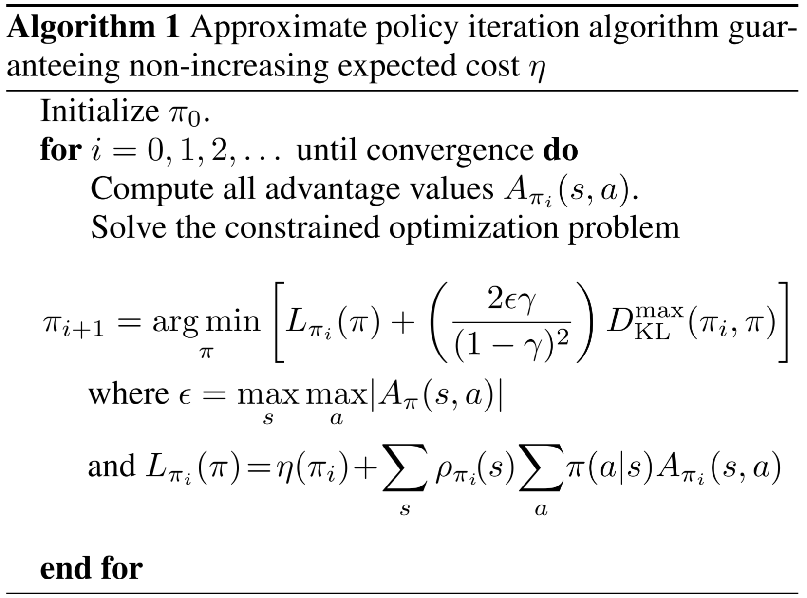

# [TRPO] Trust Region Policy Optimization

> John Schulman, Sergey Levine, Pieter Abbeel, Michael Jordan, and Philipp Moritz. 2015. Trust Region Policy Optimization. In Proceedings of the 32nd International Conference on Machine Learning, PMLR, 1889–1897. Retrieved October 4, 2022 from https://proceedings.mlr.press/v37/schulman15.html

## Overview

The paper proposed a new **practical** algorithm called ***Trust Region Policy Optimization*** (***TRPO***). The algorithm is **practical** as it can be implemented into plenty large-space environments and continuous control problems. The main innovation of the TPRO is its derivation based on the theoretically-justified algorithm [1] to do **many rounds of reasonable approximations** to make the optimizing objective be calculated effectively. Most importantly, the paper proves the proposed algorithm is **guaranteed to be improved monotonically**. TRPO is a model-free, policy-based, **on-policy**, **Monte Carlo** algorithm that can be used in environments with **continuous state space and action space**, and also support high-dimensional input and large nonlinear policies such as neural networks. The key idea is how to do approximation of the optimization objective. The paper conducts experiments in a wide range of tasks, including the robotic and Atari games domains, which shows great performance.

## Main Approximation Procedure

In this section, we will show how does the paper approximate the optimization objective step-by-step. In the following sub-sections, the notions used in this paper is a bit different from common ones. To define the MDP model, it doesn't use the reward function, but uses the **cost function** $c:S \rightarrow \mathbb{R}$, so the main target is to **minimize the expected cost**, defined as $\eta(\pi)=\mathbb{E}[\sum_{t=0}^{\infty}{\gamma^t c(s_t)}]$. 

### Preliminaries

Overall, we know the following basic concepts:

$Q_{\pi}(s_t,a_t)=\mathbb{E}[\sum_{l=0}^{\infty}{\gamma^l c(s_{t+l})}], a_t \sim \pi(s_t)$

$V_{\pi} (s_t)=\mathbb{E}[\sum_{l=0}^{\infty}{\gamma^l c(s_{t+l})}]$

We also have the advantage function:

$A_{\pi}(s,a)=Q_{\pi}(s,a)−V_{\pi}(s)$

Kakade & Lanford (2002) [1] derived the relationship of the expected discounted cost between two policies $\pi$ and $\tilde{\pi}$ to have the following equation:

$\eta(\tilde{\pi})=\eta(\pi)+\mathbb{E}_{s_0,a_0,s_1,a_1...}[\sum_{t=0}^{\infty}{\gamma^t A_{\pi}(s_t,a_t)}]$

Where the transitions are generated based on **the policy** $\tilde{\pi}$.

This is very straightforward, the actions are selected from policy $\tilde{\pi}$ but the advantages are computed by policy $\pi$. 

The paper introduced the **(unnormalized) discounted visitation frequencies** as:

$\rho_{\pi}(s)=P(s_0=s)+\gamma P(s_1=s)+...+\gamma^{\tau} P(s_{\tau}=s)+...$

So the expected discounted cost can be rearranged as:

$\eta(\tilde{\pi})=\eta(\pi)+\sum_{s}{\rho_{\tilde{\pi}}(s) \sum_{a}{\tilde{\pi}(a│s) A_{\pi}(s,a)}}$

In this case, we can see that, the cost function for the new policy $\tilde{\pi}$ equals to adding an additional term to the original cost function, so if the term $\sum_{s}{\rho_{\tilde{\pi}}(s) \sum_{a}{\tilde{\pi}(a│s) A_{\pi}(s,a)}}$ **guarantees to be a negative value**, then the update can **guarantee to reduce the cost function** $\eta$.

All of the following derivations are based on this formula, and many rounds of approximations are done from it.

### Mathematically Approximations

Firstly, the paper defines the $\eta(\tilde{\pi})$ as the main obejctive to minimize, denoted as $L_{\pi}(\tilde{\pi})$:

$L_{\pi}(\tilde{\pi})=\eta(\pi)+\sum_{s}{\rho_{\tilde{\pi}}(s) \sum_{a}{\tilde{\pi}(a│s) A_{\pi}(s,a)}}$

* The ***first approximation***: As the distribution of the states under a new policy is difficult to get, so it replaces the new policy **with the old policy**, which ignores the changes in state visitation density due to changes in the policy:
  $L_{\pi}(\tilde{\pi})=\eta(\pi)+\sum_{s}{\rho_{\pi}(s) \sum_{a}{\tilde{\pi}(a│s) A_{\pi}(s,a)}}$
  So in this case, we use the old policy $\pi$ for the state-visitation distribution.
* Then based on the **conservative policy iteration**:
  $\pi_{new} (a│s)=(1−\alpha)\pi_{old}(a│s)+\alpha \pi'(a|s)$
  And the inequation that Kakade and Langford proved:
  $\eta(\pi_{new}) \leq L_{\pi_{old}}(\pi_{new})+ \frac{2\epsilon \gamma}{(1−\gamma(1−\alpha))(1−\gamma)\alpha^2}$
  Where $\epsilon=\max_s{⁡|\mathbb{E}_{a \sim \pi' (a│s)} [A_{\pi}(s,a)]|}$
  
  The ***second approximation***: As $\alpha \ll 1$, we can approximate the above inequation as:
  $\eta(\pi_{new}) \leq L_{\pi_{old}}(\pi_{new})+\frac{2 \epsilon \gamma}{(1−\gamma)^2 \alpha^2}$

### From Conservative Policy Iteration to General Stochastic Policies

The second approximation is based on the conservative policy iteration, however, which is not commonly used in a wide range of problems, so make the algorithm applicable to more general stochastic policies methods, the crucial is to eliminate the **step factor** \alpha to extend the ineuqation (the guarantee) to practical problems.

* The ***third approximation***: replace $\alpha$ with a distance measure between $\pi$ and $\tilde{\pi}$. The paper uses the **total variance divergence** to replace $\alpha$:
  $\alpha=D_{TE}^{max}(\pi_{old},\pi_{new})$
* The ***fourth approximation***: replace the total variance divergence with the **KL divergence** based on their unequal relationship $D_{TV}(p||q)^2 \leq D_{K}(p||q)$:
  $\alpha=D_{KL}^{max}(\pi_{old},\pi_{new})$

For now, based on the finally derived objective to be minimized, the algorithm can be shown as

The algorithm provides the theorical formula to update the policies based on the assumption that we know all of the transition functions and we can directly compute the $argmin$ part. However, we usually have no exact form of the policies, which means we **cannot directly compute the** $argmin$, so in the following sections, we consider the **parameterized** policy function $\pi_{\theta}$.

### Optimization of Parameterized Policies

In this section, we consider the **parameterized** policy function $\pi_{\theta}$ to see how can we directly update the parameters from $\theta_{old}$  to $\theta$. To rewrite the objective in a parameterized form, we have:

$\eta(\theta) < L_{\theta_{old}}(\theta)+C D_{KL}^{max}(\theta_{old},\theta)$

* The ***fifth approximation***: to use a constraint on the KL divergence between the new policy and the old policy, i.e., a **trust region constraint**:
  $\min_{\theta}[L_{\theta_{old}}(\theta)]$
  $s.t. D_{KL}^{max}(\theta_{old},\theta)\leq \delta$
* The ***sixth approximation***: as the $max$ operator makes the optimizaion hard, so we can use the average KL divergence instead of the maximal:
  $\min_{\theta}[L_{\theta_{old}}(\theta)]$
  $s.t. D_{KL}^{\rho_{\theta_{old}}}(\theta_{old},\theta) \leq \delta$

### Sample-Based Estimation

Now we have had the theoretical formula, but in practice, we cannot compute the exact value of the main objective and the constraint, we usually need to estimate these values by sampling, so in this section, the paper introduced how to use ***importance sampling*** to estimate the two values.

* The ***seventh approximation***: to use importance sampling to estimate the expectation term:
  $\sum_{a}{\pi_{\theta}(a│s_n)A_{\pi_{\theta}}(s_n,a)} \approx \mathbb{E}_{a \sim q} [\frac{\pi_{\theta}(a│s)}{q(a│s)} A_{\theta_{old}}(s,a)]$
* The ***eighth approximation***: to avoid computing the advantage functions, just replace it using the Q-functions, so the final objective to optimize is:
  $\min_{\theta}⁡{\mathbb{E}_{s \sim \rho_{\theta_{old}}, a \sim q}[\frac{\pi_{\theta}(a│s)}{q(a│s)} A_{\theta_{old}}(s,a)]}$
  $s.t. \mathbb{E}_{s \sim \rho_{\theta_{old}}} [D_{KL} (\pi_{\theta_{old}}(\cdot│s)||\pi_{\theta} (\cdot|s))] \leq \delta$

### Two Variant Sampling Approaches

The paper further proposed two variant sampling approaches:
* **Single Path**: typically used for policy estimation and is based on sampling individual trajectories.
* **Vine**: construct a rollout set and then perform multiple actions from each sate in the rollout set.

## Reference

[1] Sham Kakade and John Langford. 2002. Approximately Optimal Approximate Reinforcement Learning. In Proceedings of the Nineteenth International Conference on Machine Learning (ICML ’02), Morgan Kaufmann Publishers Inc., San Francisco, CA, USA, 267–274.
