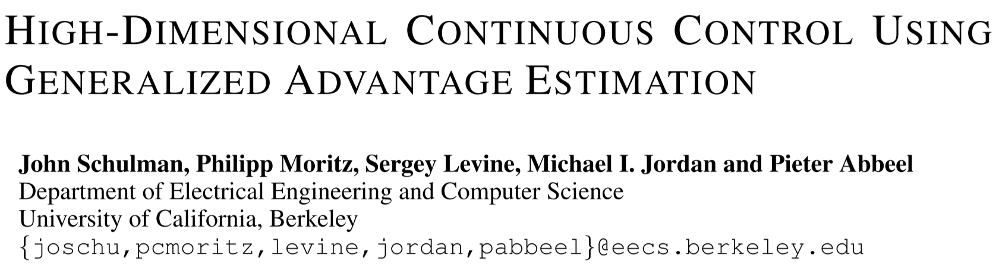
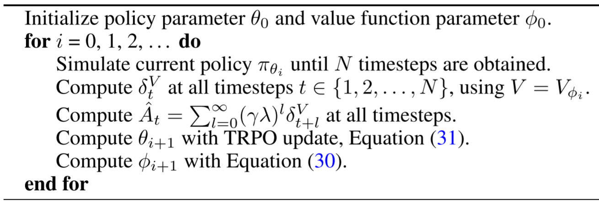
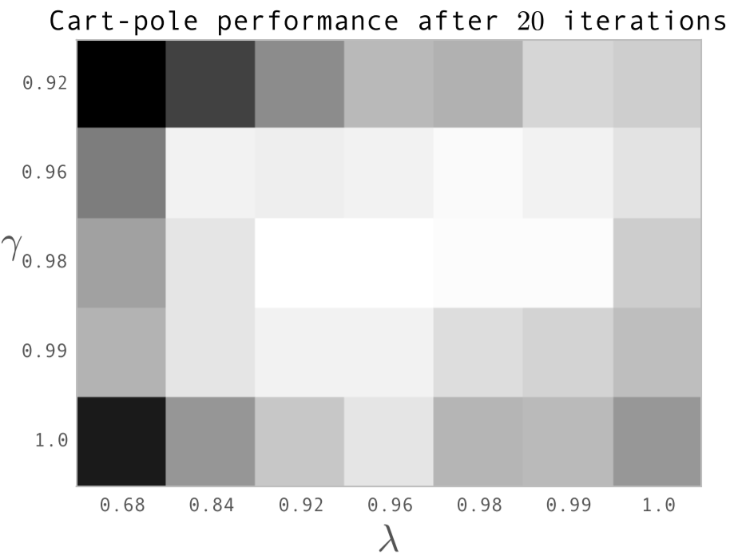

# [GAE] High-Dimensional Continuous Control Using Generalized Advantage Estimation

> John Schulman, Philipp Moritz, Sergey Levine, Michael Jordan, and Pieter Abbeel. 2018. High-Dimensional Continuous Control Using Generalized Advantage Estimation. DOI:https://doi.org/10.48550/arXiv.1506.02438

## Overview

The paper proposed an scheme called ***Generalized Advantage Estimation*** (***GAE***), which aims to trade off between reducing the variance and introduced bias. The algorithm is a **policy gradient** based algorithm, controlled by one hyper-parameter, the algorithm lives between **Monte Carlo** and **Temporal Difference**, and the two edges are inclusive. The algorithm is an **on-line learning** approach. The GAE applies the idea analogous to the TD($\lambda$), but the difference is that GAE works on advantage function, but TD($\lambda$) works on value function. The paper implemented the proposed GAE in the *Trust Region Policy Optimization* (*TRPO*) [1] algorithm, and conducted experiments in some challenging 3D robotics tasks.

## Main Problems to Solve

For the non-linear function approximators, e.g., neural networks, in deep reinforcement learning, the two main challenges are:

1. usually requires large number of samples
2. usually difficult to obtain stable and steady improvement despite the nonstationarity of the incoming data.

## Main Innovations

1. The algorithm proposed one method to trade off between the **variance** and **bias**:
   * The **variance** mainly means the algorithm learning is unstable, so there will be very high vibrate.
   * The **bias** mainly comes from the estimation of the real value function, q-function, advantage function and so on, especially when we use discounted cumulative rewards or the temporal difference estimation.
   
   In this case, the algorithm uses two hyper-parameters $\gamma$ and $\lambda$, then proposed the ***Generalized Advantage Estimation*** (***GAE***) of the advantage function which is defined as:
   
   $\hat{A}_t^{GAE}(\gamma,\lambda):=\sum_{l=0}^{\infty}{(\gamma \lambda)^l \delta_{t+l}^V}$
   
   where $\delta_{t+l}^V:= r_{t+l}+\gamma V(s_{t+l}) − V(s_{t+l−1})$, so the GAE advantage can be wrote as:
   
   $\hat{A}_t^{GAE}(\gamma,\lambda):=\sum_{l=0}^{\infty}{(\gamma \lambda)^l (r_{t+l}+\gamma V(s_{t+l}) − V(s_{t+l−1}))}$

2. The two edges of the GAE advantage are $\lambda=0$ and $\lambda=1$ respectively:
   * $\lambda=0$: $GAE(\gamma,0)$: $\hat{A}_t := r_t + \gamma V(s_{t+1}) − V(s_t)$, in this case, will introduce high bias but have lowest variance.
   * $\lambda=1$: $GAE(\gamma,1)$: $hat{A}_t := \sum_{l=0}^{\infty}{\gamma^l r_{t+l}} − V(s_t)$, in this case, will have high variance as many terms are summed up.
3. For the $0 < \lambda < 1$, the GAE can trade off between variance and bias.
4. The paper also gives an another view to interpret the GAE as a kind of reward reshaping.
5. Finally, the paper combines the proposed GAE into the popular (at that time) algorithm *TRPO* to use the GAE to estimate both the policy function and the value function. The algorithm to implement GAE into trust region based algorithm is shown as:
    

## Experiments

The paper conducted many experiments in **high-dimensional** environments with **continuous** action spaces. One results they shown in the paper that is worth to mention here is they evaluate the learning performance with different values of $\lambda$ and $\gamma$:

The figure (white means high value, black means low value) provides some insights to set these two hyper-parameters.

## Reference

[1] John Schulman, Sergey Levine, Pieter Abbeel, Michael Jordan, and Philipp Moritz. 2015. Trust Region Policy Optimization. In Proceedings of the 32nd International Conference on Machine Learning, PMLR, 1889–1897. Retrieved October 4, 2022 from https://proceedings.mlr.press/v37/schulman15.html
