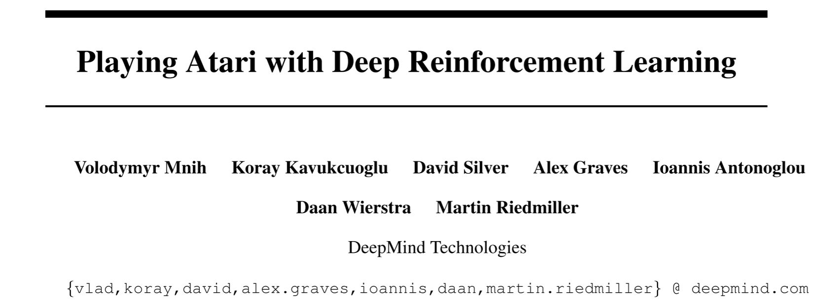
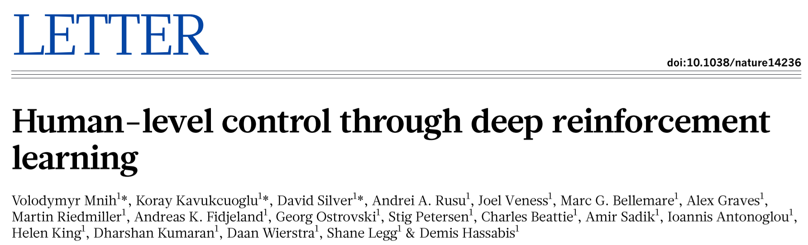
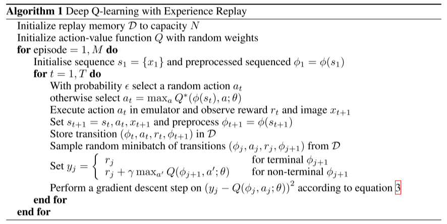

# [DQN] Deep Q-Learning Networks

## Paper to Note

> [1] Volodymyr Mnih, Koray Kavukcuoglu, David Silver, Alex Graves, Ioannis Antonoglou, Daan Wierstra, and Martin Riedmiller. 2013. Playing Atari with Deep Reinforcement Learning. DOI:<https://doi.org/10.48550/arXiv.1312.5602>

> [2] Volodymyr Mnih, Koray Kavukcuoglu, David Silver, Andrei A. Rusu, Joel Veness, Marc G. Bellemare, Alex Graves, Martin Riedmiller, Andreas K. Fidjeland, Georg Ostrovski, Stig Petersen, Charles Beattie, Amir Sadik, Ioannis Antonoglou, Helen King, Dharshan Kumaran, Daan Wierstra, Shane Legg, and Demis Hassabis. 2015. Human-level control through deep reinforcement learning. Nature 518, 7540 (February 2015), 529–533. DOI:<https://doi.org/10.1038/nature14236>

[Paper Link](https://arxiv.org/abs/1312.5602)

[Paper Link](https://www.nature.com/articles/nature14236)

## Overview

The proposed ***Deep Q-Learning Network*** (***DQN***) is the first algorithm to introduce (deep) neural networks as function approximators (in other words, non-linear function approximators) into reinforcement learning. DQN is a **model-free**, **off-policy**, **(Q-)value based** algorithm, which can be implemented onto environments with continuous state space but only with discrete action space. DQN can be trained **end-to-end**, which means it could receive high-dimensional state's representations as input. The paper evaluated the DQN on 7 Atari games [1] and 49 Atari games [2] with the same hyper-parameters which shows the great generalization ability of DQN. 

## Main Problems to Solve

To introduce deep neural networks (non-linear functions) as approximators in reinforcement learning has to overcome some problems:

1. Most deep learning algorithms (like classifications, regressions) assume that the data samples are independent, however, in RL environments, the samples in a sequence are **highly correlated**.
2. Most deep learning algorithms require large amounts of hand-labelled training data, however, RL algorithms need to learn from observations and information directly from environment, e.g., the scalar reward signals, which is frequently sparse, noisy and delayed.
3. Most deep learning methods assume they are learnt in a fixed underlaying distribution, however, in RL, the **data distribution changes** as the agents updates their behaviors during the learning process.

## Main Innovations

The paper mainly proposed two techniques to overcome the problems: (a) **experience replay** and (b) **target network with periodically update**:

1. Experience replay: initialize a replay buffer and store the transitions $\{s_t,a_t,r_t,s_{t+1}\}$  in it, for each iteration, randomly draw samples from the replay buffer and train the network using stochastic gradient descent (SGD).
    * Can break the correlations among samples so as to reduce the variance
    * Each sample can be drawn in many rounds of updates, which allows for greater data efficiency.
2. Target network with periodically update: the algorithm initializes two networks with the same hyper-parameters and architecture, for each iteration, update the policy network with SGD, for each $K$ (a hyper-parameter) iterations, directly copy the parameters in policy network to target network. In the training, the action is selected by target network.
    * The distribution of the behavior to select the action can be smooth.

The algorithm:

## Implementation Details

* Using an adaptive learning rate method such as RMSProp or ADADELTA that maintains a per-parameter learning rate α, and adjusts α according to the history of gradient updates to that parameter.
* Using the **last 4 frames** of a history and stacks them as the input to the Q-network, which can capture the information about objects' speed and acceleration.
* Pre-processing to change the RGB screens to gray-scale images and crop the central part.
* During the training, the agent observes the environment and selects an action for each $k$ frames of the video game.
