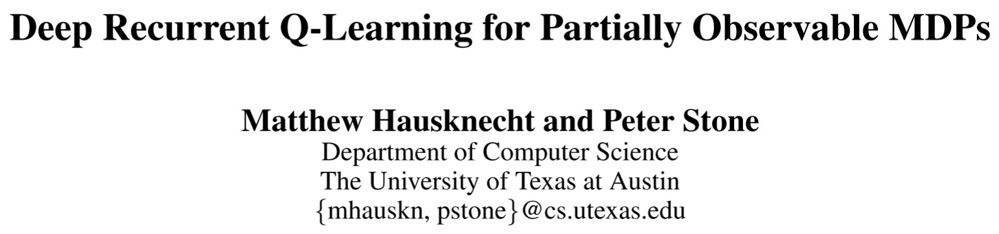

# [DRQN] Deep Recurrent Q-Learning for Partially Observable MDPs

> Matthew Hausknecht and Peter Stone. 2015. Deep Recurrent Q-Learning for Partially Observable MDPs. In 2015 AAAI Fall Symposium Series. Retrieved August 8, 2022 from https://www.aaai.org/ocs/index.php/FSS/FSS15/paper/view/11673

## Overview

The paper proposed the ***Deep Recurrent Q-Networks*** (***DRQN***) algorithm based on the famous DQN algorithm. One main standpoint the authors argued in the paper is that, for the Atari games, only one frame of the game screen is the **partial observation** of the environment. So the paper proposed to introduce the Long Short Term Memory (LSTM) block to the Q-network to catch the information in the sequence, in which case, only one frame of the screen can be used to input to the network and replicates the performance of DQN. The paper conducts experiments on a modified *flickering Pong* game and other Atari games.

## Main Problems to Solve

For the original DQN, the input is the stack of four continuous frames to include the information like the velocity and acceleration of the objects. Any game that requires a memory of more than four frames will appear **non-Markov**. What’s more , for most real-world tasks, the agent can only observe it partially, which could be modeled by ***Partially Observed Markov Decision Process*** (***POMDP***).

## Main Innovations

The main modification of DRQN from DQN are:
* Replace the first post-convolutional fully-connected layer in DQN with a **recurrent LSTM** block.
* For the input of the model, it no longer uses the stack of four continuous frames from the game (which is implemented by DQN), but use **only one frame** of the screen.

To train the DRQN model, the paper proposed two main methods, and show experiments only for the second one, as the paper indicates that their performance are almost the same.
* ***Bootstrapped Sequential Updates***: Episodes are selected randomly from the replay memory and updates begin at the beginning of the episode and proceed forward through time to the conclusion of the episode, which mean use the whole trajectory to train the model, the states along the trajectory will be input into the hidden units of LSTM module. This method violates the random sampling policy of DQN but can converge more quickly.
* ***Bootstrapped Random Updates***: Episodes are selected randomly from the replay memory and updates begin at random points in the episode and proceed for only unroll iterations timesteps. This is the same as DQN's updating policy, the hidden units are initialized as zero, which learns a bit slower than the above one.
	
The main advantage of DRQN algorithm is that it can integrate information across frames to detect relevant information despite seeing only one single frame at each step. More importantly, the model trained on POMDP can work normally on environments modeled by MDP.
