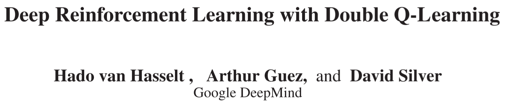

# [DDQN] Deep Reinforcement Learning with Double Q-Learning

> Hado van Hasselt, Arthur Guez, and David Silver. 2016. Deep Reinforcement Learning with Double Q-Learning. Proceedings of the AAAI Conference on Artificial Intelligence 30, 1 (March 2016). DOI: https://doi.org/10.1609/aaai.v30i1.10295

## Overview

The paper mainly answered the questions that why there exists **overestimation** in the previous reinforcement learning (RL) algorithms and how serious the overestimation is to harm the performance and lead to sub-optimal policies **theoretically**. The paper gives substantial proof of this problem and introduced the idea of ***Double Q-Learning*** [1] to the function approximation scenario to propose the ***Double Deep Q-Networks*** (***DDQN***) algorithm. The authors show experimental results on Atari games to compare the DDQN with the standard DQN and show it can not only yields more accurate value estimates, but also leads to much higher scores (better policies).

## Main Problems to Solve

The paper mainly want to overcome/relieve the overestimation problem in standard DQN algorithm.

## Main Innovations

The core idea for DDQN algorithm to reduce overestimation is to **decompose the max operation in the TD-target into *action selection* and *action evaluation***. DDQN is based on the standard DQN algorithm and uses the existing architecture **without requiring additional networks or parameters**.

In the DQN algorithm, it initialized two networks, one is called **(online) policy network** (with parameters $theta$) and another is called **target network** (with parameters $\theta'$). The parameters are copied from policy network to target network periodically. To update parameters of the policy network at each step, the algorithm randomly draw transition samples from the experience replay buffer and minimize the distance between the **TD-target** $Y$ and the current Q-value. 

The main difference is how to compute the TD-target:
* For the standard DQN:
    $Y^{DQN}=r_{t+1}+\gamma \max_{a'}⁡{Q(s_{t+1},a'|\theta')}$
	which can be written as:
	$Y^{DQN}=r_{t+1}+\gamma Q(s_{t+1},\arg\max_{a'}{Q(s_{t+1},a'|\theta')}|\theta')$
	where we can see that the selection of the action with maximal Q-value and compute the corresponding Q-value is all conducted by the target network (so it directly return the maximal Q-value among the outputs from the target network).
* For the double DQN:
    $Y^{DDQN}=r_{t+1}+\gamma Q(s_{t+1},\arg\max_{a'}{Q(s_{t+1},a'|\theta)}|\theta')$
	where we can see that the selection of the action with maximal Q-value is conducted by the policy network but the computation of the corresponding Q-value is conducted by the target network.

The process to compute the TD-target can be described as follows:
1. Input the state $s_{t+1}$ into the policy network (with parameters $\theta$), select the action with the maximal Q-value from the output head, suppose the action is $a^+$.
2. Input the state $s_{t+1}$  into the target network (with parameters $\theta'$), return the Q-value of $Q(s_{t+1},a^+)$ from the output head.
3. Use the returned Q-value to compute the TD-target.

## Reference

[1] Hado Hasselt. 2010. Double Q-learning. In Advances in Neural Information Processing Systems, Curran Associates, Inc. Retrieved August 8, 2022 from https://proceedings.neurips.cc/paper/2010/hash/091d584fced301b442654dd8c23b3fc9-Abstract.html
