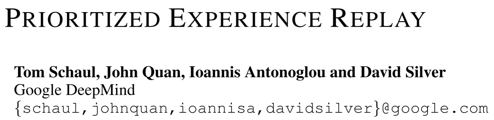

# [PER] Prioritized Experience Replay

> Prioritized Experience Replay. Retrieved August 9, 2022 from https://www.deepmind.com/publications/prioritized-experience-replay

## Overview

The paper proposed a ***prioritized experience replay*** (***PER***) framework to be implemented in to experience-replay-based RL algorithms to replace the original uniformly and randomly draw samples. The paper further proposed two methods to solve problems that introduced by the prioritized: one is the diversity of loss, another one is the introduced bias. The paper evaluated the framework integrated into the DDQN algorithm, and show better performances than the state-of-the-art algorithms (2016).

## Main Problems to Solve

The prioritized experience replay method is proposed for more efficiently and more effectively learning of the experience-replay-based deep RL algorithms. As in the previous experience replay method, all samples to train the model are drawn uniformly from the replay buffer at random, however, many transitions are not useful to update or to optimize the model in the desired direction.

## Main Innovations

The main idea for the framework is to sample transitions from the replay buffer using the magnitude of the TD-error $\delta$ as the priority. Intuitively, the larger of the TD-error for one transition, the distance between the TD-target and the currently estimated Q-value will be larger, then the agent should learn more from it than others.

However, there are two main problems that caused by the prioritized experience replay: the **loss diversity decreasing** and the **bias introduced**.

Firstly, the loss diversity will decrease. As the samples are drawn based on the TD-error at the first computation when storing them into the buffer, so some samples with very low TD-errors will have very low probabilities to be selected or even never be selected, in which case, the framework will focus on a very small subset of the experiences, which leads the system to over-fitting.

To solve this problem, the paper proposed ***stochastic prioritization***, that interpolates between pure greedy prioritization and uniform random sampling. The probability to select one sample $i$ is defined as:

$P(i)=\frac{p_i^{\alpha}}{\sum_k{p_k^{\alpha}}}$

where $\alpha$ determines how much prioritization is used, with $\alpha=0$ corresponding to the uniform case.

Secondly, the prioritized experience replay introduced bias, as the target/real distribution changes when we draw samples non-uniformly. To solve this problem, the paper proposed to correct the bias by using the ***importance-sampling weights*** which is defined as:

$w_i=(\frac{1}{N} \times \frac{1}{P(i)})^{\beta}$

which can be folded into the Q-learning update by using $w_i \delta_i$  instead of $\delta_i$. The hyper-parameter $\beta$ controls the degree to compensate the bias. The paper proposed to use an ***annealing*** method to set the $\beta$ as a very small value at the beginning and define a schedule to make it reach 1 at the end of the training.
