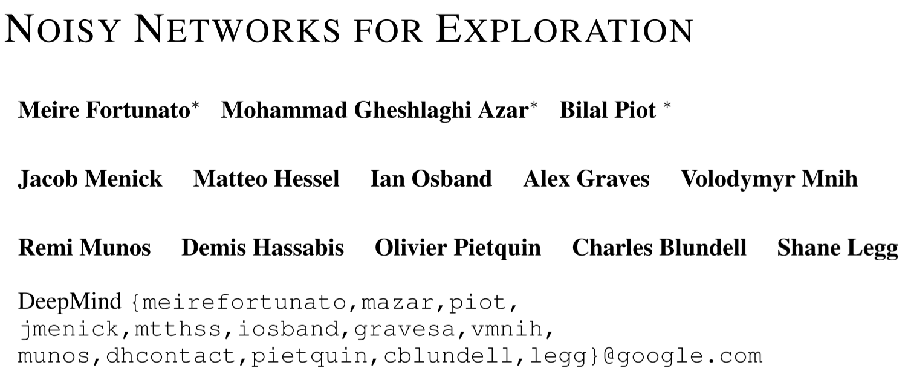

# [NoisyNet] Noisy Networks for Exploration

> Meire Fortunato, Mohammad Gheshlaghi Azar, Bilal Piot, Jacob Menick, Ian Osband, Alex Graves, Vlad Mnih, Remi Munos, Demis Hassabis, Olivier Pietquin, Charles Blundell, and Shane Legg. 2019. Noisy Networks for Exploration. DOI: https://doi.org/10.48550/arXiv.1706.10295

## Overview

The paper proposed a general framework ***NoisyNet*** to introduce **parametric noise** to add to the weights in the network and aid the agent to exploration more efficiently and effectively. The framework can be implemented into any RL algorithms with **gradient descent**, like DQN, DDQN, Dueling DQN, DDPG, A3C, TRPO and so on, which also add little computational overhead. The *NoisyNet* can replace the original exploration policies, like $\epsilon$-greedy exploration. The paper conducted experiments to compare the DQN, Dueling DQN and A3C algorihtms with *NoisyNet* respectively with the original version of these algorithms, the results show higher scores for a wide range of Atari games.

## Main Problems to Solve

For traditional exploration policies, like entropy reward and $\epsilon$-greddy, there needs additional hyper-parameters and more importantly, the policy is independent of the states and policies learned by the agents.

## Main Innovations

The key idea of the *NoisyNet* is to add a parametric noise to the parameters (weights) (to be learned) of the networks. The added noise can help to make the agent to select creative behaviors. More importantly, as the noise is parametric, and the parameters are also updated in the reinforcement learning algorithm by gradient descent with the original parameters, so the noise can be controlled by the model during the learning procedure and therefore, the noise is dependent of the states and the policy.

The main method to change an original parameter $\theta$ to a new set of learnable parameters is to define:

$\theta^{new}=\mu^{\theta}+\Sigma^{\theta} \odot \epsilon^{\theta}$

where $\mu$ can be seen as the original weight, and $\Sigma$ is the factor to be multiplied to the noise to control the noise to be added onto the original weight, $\epsilon$ is the generated **zero-mean noise with fixed statics**, **element-wise multiplied** by the control factor. In this case, the original parameter $\theta$ to learn is replaced by a set of parameter $\zeta=[\mu^{\theta},\Sigma^{\theta}]$. We can see from the equation, the *NoisyNet* doesn't change or control the distribution of the parameters in the network, but only learn to control the intensity of the noise **automatically**. The parameters of the noise $\Sigma$ can also be learned in the RL algorithm accompanying the parameters from the model.

The paper proposed two approaches to generate noise:

* **Independent Gaussian noise**: uses an independent Gaussian noise entry per weight.
* **Factorised Gaussian noise**: uses an independent noise per each output and another independent noise per each input.

## Implementation Details

The paper implements the *NoisyNet* framework into three RL algorithms to build the Noisy-DQN, Noisy-Dueling-DQN, and the Noisy-A3C and compare them with the original algorithms respectively.

1. For the noisy-based algorithms, the original exploration policies, like $\epsilon$-greedy is canceled.
2. A noisy network agent samples a new set of parameters after every step of optimization. Between optimization steps, the agent acts according to a fixed set of parameters.
3. The *NoisyNet* is not implemented into all parameters in the original network, but only replace parts of them, like in the DQN and Dueling DQN, the noise is only added onto parameters in the fully connected layers.
